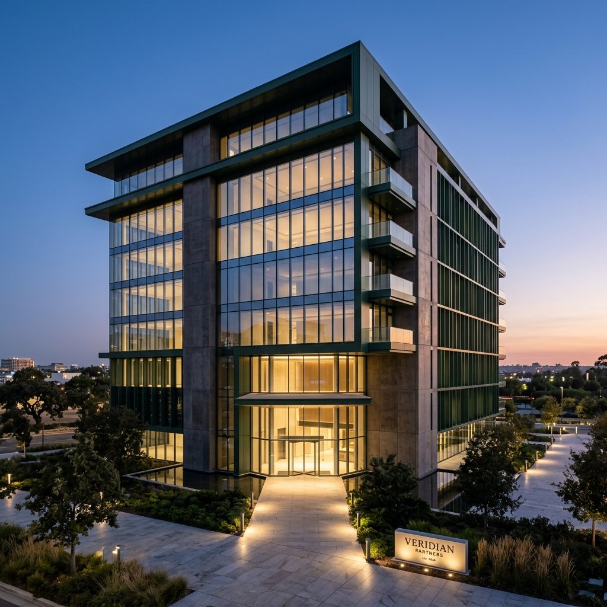

# Lima Cahaya — Company Profile Website

Website company profile static modern untuk **Lima Cahaya**, perusahaan arsitek dan konstruksi premium Indonesia.



---

## 🛠️ Tech Stack

| Teknologi | Versi |
|-----------|-------|
| Vite | ^8.x |
| TailwindCSS | ^4.x |
| Vanilla JavaScript (ES Modules) | - |
| Lucide Icons | Latest |
| AOS (Animate on Scroll) | 2.3.4 |
| Google Fonts (Poppins) | - |

---

## 📁 Struktur Folder

```
landing-page-limacahaya/
├── index.html              # Entry point utama
├── vite.config.js          # Konfigurasi Vite
├── tailwind.config.js      # Konfigurasi TailwindCSS
├── postcss.config.js       # Konfigurasi PostCSS
├── package.json
├── README.md
├── public/
│   ├── favicon.svg
│   └── images/             # Asset gambar statis
│       ├── hero-architecture.jpg
│       ├── portfolio-interior.jpg
│       ├── portfolio-commercial.jpg
│       ├── portfolio-renovation.jpg
│       └── portfolio-bedroom.jpg
└── src/
    ├── style.css           # Main CSS (Tailwind + Custom)
    └── main.js             # JavaScript utama
```

---

## 🚀 Cara Install & Menjalankan

### Prerequisites
- Node.js >= 18.x
- npm >= 9.x

### Install Dependencies

```bash
npm install
```

### Development Server

```bash
npm run dev
```

Buka browser di `http://localhost:5173`

### Build Production

```bash
npm run build
```

Output di folder `dist/`

### Preview Production Build

```bash
npm run preview
```

---

## 🌐 Deploy ke GitHub Pages

### Metode 1: Manual Upload

1. Build project:
   ```bash
   npm run build
   ```

2. Upload isi folder `dist/` ke branch `gh-pages` di GitHub.

3. Di GitHub repository → Settings → Pages → Source: `gh-pages` branch.

### Metode 2: GitHub Actions (Otomatis)

Buat file `.github/workflows/deploy.yml`:

```yaml
name: Deploy to GitHub Pages

on:
  push:
    branches: [main]

jobs:
  deploy:
    runs-on: ubuntu-latest
    steps:
      - uses: actions/checkout@v4
      
      - name: Setup Node.js
        uses: actions/setup-node@v4
        with:
          node-version: '20'
          cache: 'npm'
      
      - name: Install dependencies
        run: npm ci
      
      - name: Build
        run: npm run build
      
      - name: Deploy to GitHub Pages
        uses: peaceiris/actions-gh-pages@v4
        with:
          github_token: ${{ secrets.GITHUB_TOKEN }}
          publish_dir: ./dist
```

### Metode 3: gh-pages package

```bash
npm install --save-dev gh-pages
```

Tambahkan script di `package.json`:
```json
{
  "scripts": {
    "deploy": "npm run build && gh-pages -d dist"
  }
}
```

Lalu jalankan:
```bash
npm run deploy
```

---

## ✏️ Kustomisasi

### 1. Informasi Perusahaan

Edit di `index.html`:
- **Nama Perusahaan**: Cari teks `Lima Cahaya` dan ganti sesuai nama perusahaan.
- **Nomor WhatsApp**: Ganti semua `6281234567890` dengan nomor WA aktif.
- **Alamat Kantor**: Cari teks `Jl. Sudirman No. 88` dan ganti.
- **Email**: Ganti `hello@limacahaya.id` dengan email aktif.
- **Social Media**: Update semua URL social media.

### 2. Warna Brand

Edit di `tailwind.config.js`:
```js
colors: {
  secondary: {
    DEFAULT: '#0F3D2E',  // Ganti warna utama
    // ...
  },
  emerald: {
    DEFAULT: '#10B981',  // Ganti warna aksen
    // ...
  }
}
```

### 3. Gambar Portfolio

Ganti gambar di folder `public/images/` dan update referensi di `index.html`.

### 4. Konten Section

Semua konten section (hero, layanan, portfolio, testimoni, dll.) ada di `index.html` dan dapat diedit langsung.

---

## 🎨 Fitur Website

- ✅ **Sticky Navbar** — Transparan → solid saat scroll
- ✅ **Hero Section** — Fullscreen dengan floating cards animasi
- ✅ **Stats Counter** — Animated number counter
- ✅ **Tentang Kami** — Grid modern dengan visi misi
- ✅ **6 Layanan** — Card dengan hover lift dan gradient border
- ✅ **6 Portfolio** — Gallery dengan hover overlay
- ✅ **5 Keunggulan** — Feature list dengan icon premium
- ✅ **6 Testimoni** — Auto-sliding carousel dengan dots navigation
- ✅ **Contact Form** — Form dengan validasi + WhatsApp CTA
- ✅ **Footer** — Dark elegant dengan quick links
- ✅ **Responsive** — Mobile-first, sempurna di semua device
- ✅ **SEO Ready** — Meta tags, semantic HTML, OG tags
- ✅ **Animasi** — AOS scroll reveal, floating cards, counter
- ✅ **Ripple Effect** — Pada semua tombol

---

## 📱 Responsive Breakpoints

| Breakpoint | Ukuran |
|------------|--------|
| Mobile | < 640px |
| Tablet | 640px – 1024px |
| Desktop | > 1024px |
| Large Screen | > 1280px |

---

## 📦 NPM Scripts

| Command | Fungsi |
|---------|--------|
| `npm run dev` | Development server |
| `npm run build` | Build production |
| `npm run preview` | Preview production build |

---

## 📞 Informasi Kontak (Placeholder)

Semua kontak di bawah adalah placeholder dan harus diganti:

- **WhatsApp**: +62 812-3456-7890
- **Email**: hello@limacahaya.id
- **Alamat**: Jl. Sudirman No. 88, Jakarta Selatan

---

## 📄 Lisensi

© 2026 Lima Cahaya. Hak cipta dilindungi.
